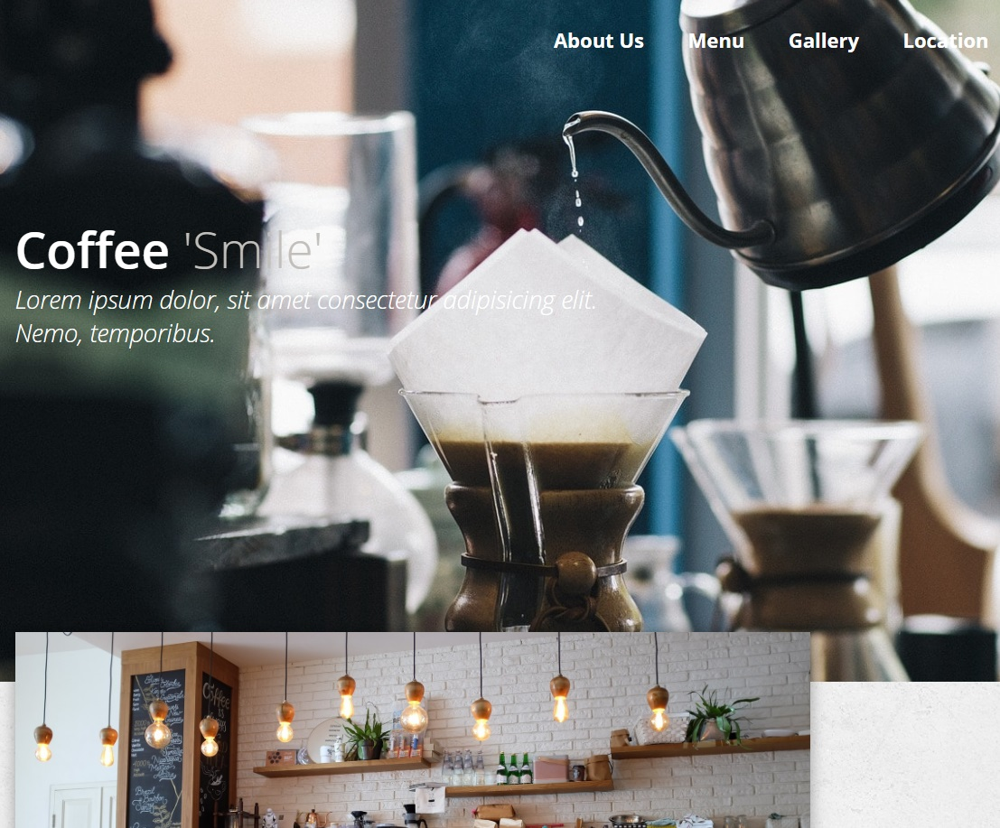

# Coffee shop webpage

Done with JS + jQuery

## 09/09/19
I did this page like a year ago and now I've started to put away the jQuery code and use only ES5/6 syntax.

For example the first change I did was the menu effect, now it's done with JS and a CSS animation.

The next task is doing the same but with 'about us' div 